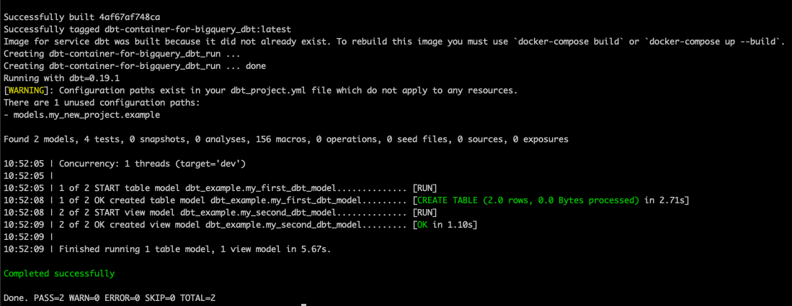

# dbt-container-for-bigquery
A template project to run DBT jobs inside a docker container with BigQuery

## Who is it for?
- Anyone new to DBT wants to get started quickly following best practices.
- Anyone new or already using DBT wants to run DBT jobs insider containers both locally and on production.

## Key Features
- Run DBT jobs inside a docker container locally to reduce effort on setting things up and to speed up development.
- Uses service account impersonation with DBT to remove the need of service account keys. Also see [Permissions for service accounts](https://cloud.google.com/iam/docs/understanding-service-accounts#permissions_for_service_accounts) for more details about Service Account Impersonation and the reasons behind it.
- Works for both local development and for production.

## Prerequisites
1. Have [Docker Desktop](https://www.docker.com/products/docker-desktop) installed
1. Have Python 3.6+ installed

## Get Started
### Clone the repository
Clone the project using
```bash
git clone git@github.com:rocketechgroup/dbt-container-for-bigquery.git
```
or clone it using a GUI tool such as [Github Desktop](https://desktop.github.com/) with the `https` link
```
https://github.com/rocketechgroup/dbt-container-for-bigquery.git
```
This will clone the project repository to a `<project repository location>` of your choice

### Create a Python Virtual Environment
This is required in order to enable automation, we use a tool called [Invoke](http://www.pyinvoke.org/) so that the automation works for both Mac/Linux or Windows users.

First, open the terminal and `cd` into the `<project repository location>` and create the virtual environment with
```bash
python3 -m venv venv
```
The `venv` directory under this project is already ignored by version control.

Then activate the virtual environment by running
> Mac / Linux
```bash
source ./venv/bin/activate
```
> Windows
```bash
./venv/Scripts/activate
```

Finally, install required python dependencies
```bash
pip install -r ./infrastructure/requirements.venv.txt
```

### Run DBT commands inside the container
To run the DBT job inside the Docker container, the following environment variables are required
```
PROJECT_ID=<GCP project id where DBT will persist data to>
LOCATION=<Location of where DBT will read & persist data to>
DEFAULT_DATASET=<The default dataset required by DBT>
```
if you are on Mac / Linux, they can be easily defined as command line arguments, i.e.
```
PROJECT_ID=example-project-id LOCATION=US DEFAULT_DATASET=dbt_example invoke exec "dbt run"
```

if you are on Windows, it might be easier to run this inside an IDE such as PyCharm as below where a Python Configuration can be defined and triggered to run DBT jobs. 
   

   

Supported invoke commands are
- `invoke exec` followed by any valid dbt commands in `double quotes` such as
    - `invoke exec "dbt run"
    - `invoke exec "dbt test"
    - `invoke exec "dbt --version"
    - ...
- `invoke build` to force rebuild the docker container. This is required if a new version is made available to the docker container. When executed this will rebuild the following images
    - `rocketechgroup/dbt-dev`: designed for local development. All required DBT project folders / files are mounted as volumes so that changes made on your laptop will be instantly reflected inside the container. In addition, `gcloud` is installed and `application_default_credentials.json` is used to allow service account impersonation as a GCP user.
    - `rocketechgroup/dbt-prod`: designed for production user (i.e. via Cloud Composer). All required DBT project folders / files are copied into the container at build time so that they do not change.
- `invoke debug` followed by any arbitrary commands inside the docker container, such as
    - `invoke debug "ls"` 
    - `invoke debug "cat dbt_project.yml"`

Please note that it might take a few minutes the firs time this is executed because it has to build the docker container from scratch but subsequent runs should be executed within seconds. 
Once the execution is successful you should see something like this
   